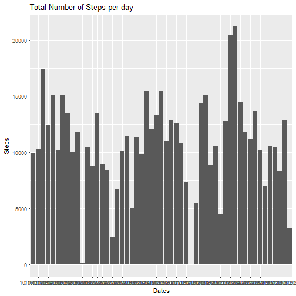
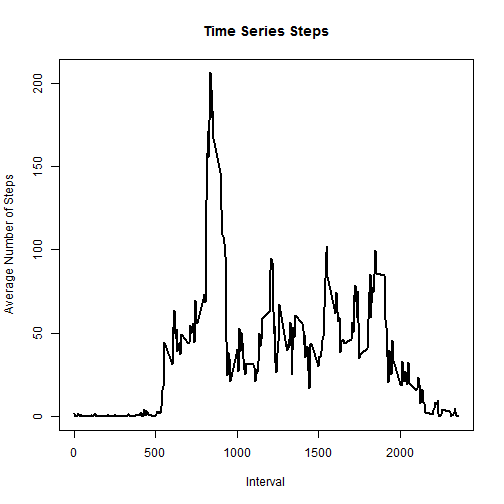
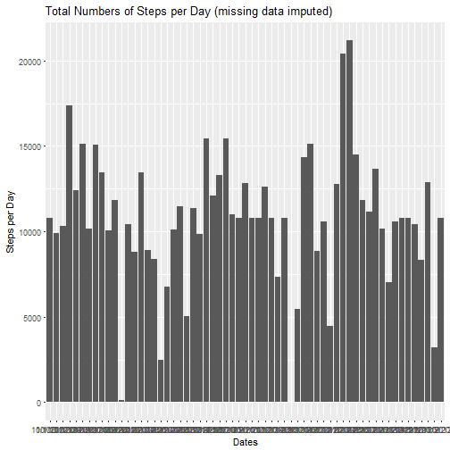
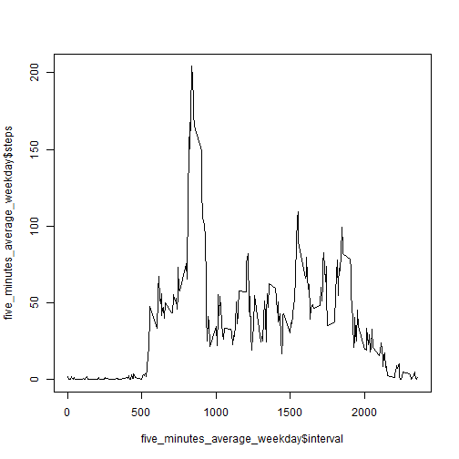
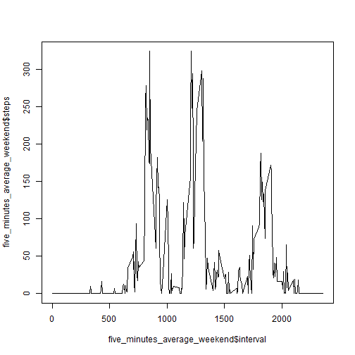

```r
---
title: "Project 1 Reproducible Research"
author: "Justin Mahoney"
date: "December 8, 2016"
output: html_document
---
```

```
## Error: <text>:8:0: unexpected end of input
## 6: ---
## 7: 
##   ^
```


## Set working direectory & load the dataset

```r
rm(list=ls())
setwd("C:/Users/justin.mahoney/Desktop/Reproducible Research")

#Process/transform the data (if necessary) into a format suitable for your analysis
exercise <- read.csv("dataproject1.csv", header = TRUE, colClasses = c("numeric", "character", "integer"))
```
## Load the required packages

```r
library(psych)
```

```
## Warning: package 'psych' was built under R version 3.3.2
```

```r
library(plyr)
library(dplyr)
```

```
## 
## Attaching package: 'dplyr'
```

```
## The following objects are masked from 'package:plyr':
## 
##     arrange, count, desc, failwith, id, mutate, rename, summarise,
##     summarize
```

```
## The following objects are masked from 'package:stats':
## 
##     filter, lag
```

```
## The following objects are masked from 'package:base':
## 
##     intersect, setdiff, setequal, union
```

```r
library(lubridate)
```

```
## Warning: package 'lubridate' was built under R version 3.3.2
```

```
## 
## Attaching package: 'lubridate'
```

```
## The following object is masked from 'package:plyr':
## 
##     here
```

```
## The following object is masked from 'package:base':
## 
##     date
```

```r
library(ggplot2)
```

```
## Warning: package 'ggplot2' was built under R version 3.3.2
```

```
## 
## Attaching package: 'ggplot2'
```

```
## The following objects are masked from 'package:psych':
## 
##     %+%, alpha
```

```r
library(reshape2)
```

```
## Warning: package 'reshape2' was built under R version 3.3.2
```

```r
library(knitr)
```
## Show first lines of 'exercise' file

```r
head(exercise)
```

```
##   steps      date interval
## 1    NA 10/1/2012        0
## 2    NA 10/1/2012        5
## 3    NA 10/1/2012       10
## 4    NA 10/1/2012       15
## 5    NA 10/1/2012       20
## 6    NA 10/1/2012       25
```

# What is mean total number of steps taken per day? 
### 1. Calculate the total number of steps taken per day. Then, make a histogram of the total number of steps taken each day.

```r
## make data set with no missing values 
data_NO_na <- melt(data = exercise,id.vars="date", measure.vars="steps", na.rm= TRUE)
head(exercise)
```

```
##   steps      date interval
## 1    NA 10/1/2012        0
## 2    NA 10/1/2012        5
## 3    NA 10/1/2012       10
## 4    NA 10/1/2012       15
## 5    NA 10/1/2012       20
## 6    NA 10/1/2012       25
```

```r
head(data_NO_na)
```

```
##          date variable value
## 289 10/2/2012    steps     0
## 290 10/2/2012    steps     0
## 291 10/2/2012    steps     0
## 292 10/2/2012    steps     0
## 293 10/2/2012    steps     0
## 294 10/2/2012    steps     0
```

```r
dim(exercise)
```

```
## [1] 17568     3
```

```r
dim(data_NO_na)
```

```
## [1] 15264     3
```

```r
str(exercise)
```

```
## 'data.frame':	17568 obs. of  3 variables:
##  $ steps   : num  NA NA NA NA NA NA NA NA NA NA ...
##  $ date    : chr  "10/1/2012" "10/1/2012" "10/1/2012" "10/1/2012" ...
##  $ interval: int  0 5 10 15 20 25 30 35 40 45 ...
```

```r
## code to convert date to 'date' variable  ----> exercise$date <- as.Date(exercise$date)
str(exercise)
```

```
## 'data.frame':	17568 obs. of  3 variables:
##  $ steps   : num  NA NA NA NA NA NA NA NA NA NA ...
##  $ date    : chr  "10/1/2012" "10/1/2012" "10/1/2012" "10/1/2012" ...
##  $ interval: int  0 5 10 15 20 25 30 35 40 45 ...
```

```r
steps_date <- dcast(data_NO_na, date ~ variable, sum)
dim(steps_date)
```

```
## [1] 53  2
```

```r
## data set showing number of steps per day
steps_date
```

```
##          date steps
## 1  10/10/2012  9900
## 2  10/11/2012 10304
## 3  10/12/2012 17382
## 4  10/13/2012 12426
## 5  10/14/2012 15098
## 6  10/15/2012 10139
## 7  10/16/2012 15084
## 8  10/17/2012 13452
## 9  10/18/2012 10056
## 10 10/19/2012 11829
## 11  10/2/2012   126
## 12 10/20/2012 10395
## 13 10/21/2012  8821
## 14 10/22/2012 13460
## 15 10/23/2012  8918
## 16 10/24/2012  8355
## 17 10/25/2012  2492
## 18 10/26/2012  6778
## 19 10/27/2012 10119
## 20 10/28/2012 11458
## 21 10/29/2012  5018
## 22  10/3/2012 11352
## 23 10/30/2012  9819
## 24 10/31/2012 15414
## 25  10/4/2012 12116
## 26  10/5/2012 13294
## 27  10/6/2012 15420
## 28  10/7/2012 11015
## 29  10/9/2012 12811
## 30 11/11/2012 12608
## 31 11/12/2012 10765
## 32 11/13/2012  7336
## 33 11/15/2012    41
## 34 11/16/2012  5441
## 35 11/17/2012 14339
## 36 11/18/2012 15110
## 37 11/19/2012  8841
## 38  11/2/2012 10600
## 39 11/20/2012  4472
## 40 11/21/2012 12787
## 41 11/22/2012 20427
## 42 11/23/2012 21194
## 43 11/24/2012 14478
## 44 11/25/2012 11834
## 45 11/26/2012 11162
## 46 11/27/2012 13646
## 47 11/28/2012 10183
## 48 11/29/2012  7047
## 49  11/3/2012 10571
## 50  11/5/2012 10439
## 51  11/6/2012  8334
## 52  11/7/2012 12883
## 53  11/8/2012  3219
```

```r
### Make histogram of steps per day
ggplot(steps_date, aes(x=date, y=steps)) + geom_histogram(stat="identity")+ xlab("Dates")+ ylab("Steps")+ labs(title= "Total Number of Steps per day")
```

```
## Warning: Ignoring unknown parameters: binwidth, bins, pad
```



```r
### code to convert date to 'date' variable  ----> exercise$date <- ymd(exercise$date)
```
### 3. Calculate and report the mean and median of the total number of steps taken per day

```r
total_steps_each_day <- aggregate(steps~date, data = exercise, FUN = sum, na.rm = TRUE)
###Calculate mean & median of total steps each day
total_steps_each_day_mean <- mean(steps_date$steps)
total_steps_each_day_median <-median(steps_date$steps)
### mean 'total steps each day'
total_steps_each_day_mean 
```

```
## [1] 10766.19
```

```r
### median 'total steps each day'
total_steps_each_day_median 
```

```
## [1] 10765
```

```r
### Calculate total number of steps
total_steps <- sum(exercise$steps, na.rm = TRUE)
total_steps
```

```
## [1] 570608
```

# What is the average daily activity pattern?
### 1. Make a time series plot (i.e. type = "l") of the 5-minute interval (x-axis) and the average number of steps taken, averaged across all days (y-axis)

```r
five_minutes_average <- aggregate(steps~interval, data=exercise, FUN=mean, na.rm=TRUE)
plot(x = five_minutes_average$interval, y = five_minutes_average$steps, type = "l", main="Time Series Steps",xlab="Interval", ylab="Average Number of Steps", col="black", lwd=2) 
```


### 2. Which 5-minute interval, on average across all the days in the dataset, contains the maximum number of steps?

```r
five_minutes_average[which.max(five_minutes_average$steps), ]$interval
```

```
## [1] 835
```
#Imputing missing values
###Note that there are a number of days/intervals where there are missing values (coded as NA). The presence of missing days may introduce bias into some calculations or summaries of the data.
### 1. Calculate and report the total number of missing values in the dataset (i.e. the total number of rows with NAs)

```r
sum(is.na(exercise$steps))
```

```
## [1] 2304
```
### 2. Devise a strategy for filling in all of the missing values in the dataset. The strategy does not need to be sophisticated. For example, you could use the mean/median for that day, or the mean for that 5-minute interval, etc. Create a new dataset that is equal to the original dataset but with the missing data filled in.
# Code to fill in the missing values to create new dataset

```r
new <- exercise %>%
        group_by(interval) %>%
        mutate(steps = ifelse(is.na(steps), mean(steps, na.rm=TRUE), steps))
summary(new)
```

```
##      steps            date              interval     
##  Min.   :  0.00   Length:17568       Min.   :   0.0  
##  1st Qu.:  0.00   Class :character   1st Qu.: 588.8  
##  Median :  0.00   Mode  :character   Median :1177.5  
##  Mean   : 37.38                      Mean   :1177.5  
##  3rd Qu.: 27.00                      3rd Qu.:1766.2  
##  Max.   :806.00                      Max.   :2355.0
```

```r
dim(new)
```

```
## [1] 17568     3
```
### Make a histogram of the total number of steps taken each day and Calculate and report the mean and median total number of steps taken per day. Do these values differ from the estimates from the first part of the assignment? What is the impact of imputing missing data on the estimates of the total daily number of steps?

```r
new.steps <- new %>%
  group_by(date) %>%
  summarize(steps = sum(steps)) %>%
  print    
```

```
## # A tibble: 61 × 2
##          date    steps
##         <chr>    <dbl>
## 1   10/1/2012 10766.19
## 2  10/10/2012  9900.00
## 3  10/11/2012 10304.00
## 4  10/12/2012 17382.00
## 5  10/13/2012 12426.00
## 6  10/14/2012 15098.00
## 7  10/15/2012 10139.00
## 8  10/16/2012 15084.00
## 9  10/17/2012 13452.00
## 10 10/18/2012 10056.00
## # ... with 51 more rows
```
### Make histogram

```r
ggplot(new.steps, aes(x=date, y=steps))+geom_histogram(stat="identity")+ xlab("Dates")+ ylab("Steps per Day")+ labs(title= "Total Numbers of Steps per Day (missing data imputed)", bin=1)
```

```
## Warning: Ignoring unknown parameters: binwidth, bins, pad
```



```r
### give dimensions of 'new.steps'
dim(new.steps)
```

```
## [1] 61  2
```
### Calculate mean and medain of 'total number of steps taken per day'

```r
imputed.steps <- tapply(new$steps, new$date, FUN = sum, na.rm = TRUE)
##new$date <- ymd(new$date)
### Calculate mean
mean(imputed.steps)
```

```
## [1] 10766.19
```

```r
### Calculate median
median(imputed.steps)
```

```
## [1] 10766.19
```

```r
dim(imputed.steps)
```

```
## [1] 61
```

```r
### Show summary (including mean and median) of 'imputed.steps' & 'steps_date'
summary(steps_date)
```

```
##      date               steps      
##  Length:53          Min.   :   41  
##  Class :character   1st Qu.: 8841  
##  Mode  :character   Median :10765  
##                     Mean   :10766  
##                     3rd Qu.:13294  
##                     Max.   :21194
```

```r
summary(imputed.steps)
```

```
##    Min. 1st Qu.  Median    Mean 3rd Qu.    Max. 
##      41    9819   10770   10770   12810   21190
```
# Conclusion:
### the 'mean' and 'median' values differ only by a small amount from the estimates from the first part of the assignment. There is only a small impact from imputing missing data on the estimates of the total daily number of steps.

#Are there differences in activity patterns between weekdays and weekends?
### 1. Create a new factor variable in the dataset with two levels - "weekday" and "weekend" indicating whether a given date is a weekday or weekend day.

```r
### clear files
###rm(list=ls())
###show files
ls()
```

```
##  [1] "data_NO_na"                  "exercise"                   
##  [3] "five_minutes_average"        "imputed.steps"              
##  [5] "new"                         "new.steps"                  
##  [7] "steps_date"                  "total_steps"                
##  [9] "total_steps_each_day"        "total_steps_each_day_mean"  
## [11] "total_steps_each_day_median"
```

```r
### 1st - calculate 5 minute average
five_minutes_average <- aggregate(steps~interval, data=exercise, FUN=mean, na.rm=TRUE)
### show 5 minute aaverage
head(five_minutes_average)
```

```
##   interval     steps
## 1        0 1.7169811
## 2        5 0.3396226
## 3       10 0.1320755
## 4       15 0.1509434
## 5       20 0.0754717
## 6       25 2.0943396
```
### reload exercise data

```r
exercise <- read.csv("dataproject1.csv", header = TRUE, colClasses = c("numeric", "Date", "integer"))

activity_filled_in <- exercise
for (i in 1:17568) # loop to find the na
{
    if(is.na(activity_filled_in$steps[i])) # if steps is na store the pointer 
    { 
        five_minute_pointer <- activity_filled_in$interval[i] #store the value of pointer to find the mean on five minute interval
        for (j in 1:288)  # loop to find the value of pointer on the data frame of five minute interval
        {
            if (five_minutes_average$interval[j] == five_minute_pointer) # finding the value of mean of five minute interval data frame
                activity_filled_in$steps[i] <- five_minutes_average$steps[j] # replacing the na by the mean in that fime minute interval 

        }
    }
}


# show first 6 lines of 'activity_filled_in
head(activity_filled_in)
```

```
##       steps       date interval
## 1 1.7169811 0010-01-20        0
## 2 0.3396226 0010-01-20        5
## 3 0.1320755 0010-01-20       10
## 4 0.1509434 0010-01-20       15
## 5 0.0754717 0010-01-20       20
## 6 2.0943396 0010-01-20       25
```

```r
str(activity_filled_in)
```

```
## 'data.frame':	17568 obs. of  3 variables:
##  $ steps   : num  1.717 0.3396 0.1321 0.1509 0.0755 ...
##  $ date    : Date, format: "0010-01-20" "0010-01-20" ...
##  $ interval: int  0 5 10 15 20 25 30 35 40 45 ...
```

```r
##activity_filled_in$date <- ymd(activity_filled_in)

str(activity_filled_in)
```

```
## 'data.frame':	17568 obs. of  3 variables:
##  $ steps   : num  1.717 0.3396 0.1321 0.1509 0.0755 ...
##  $ date    : Date, format: "0010-01-20" "0010-01-20" ...
##  $ interval: int  0 5 10 15 20 25 30 35 40 45 ...
```

```r
# check that there are no missing values in 'activity_filled_in'
total_na <- 0
for (i in 1:17568)
{
    if(is.na(activity_filled_in$steps[i])) 
        total_na <- total_na+1 
}
total_na
```

```
## [1] 0
```

```r
#
activity_filled_in$weekdayType<- ifelse(weekdays(activity_filled_in$date) %in% c("Satuday", "Sunday"), 
    "weekend", "weekday")

head(activity_filled_in$weekdayType)
```

```
## [1] "weekday" "weekday" "weekday" "weekday" "weekday" "weekday"
```

```r
head(activity_filled_in)
```

```
##       steps       date interval weekdayType
## 1 1.7169811 0010-01-20        0     weekday
## 2 0.3396226 0010-01-20        5     weekday
## 3 0.1320755 0010-01-20       10     weekday
## 4 0.1509434 0010-01-20       15     weekday
## 5 0.0754717 0010-01-20       20     weekday
## 6 2.0943396 0010-01-20       25     weekday
```

```r
### doing plot
## Make a panel plot containing time series plot (type 1) of the 5 minute interval (x axis) and the average number of steps taken (averaged across weekend or weekday days) on the y axis

#finding elements by "weekday" or "weekend"
weekday <- grep("weekday",activity_filled_in$weekday)
weekday_frame <- activity_filled_in[weekday,]
weekend_frame <- activity_filled_in[-weekday,]

#What is the average daily activity pattern?
five_minutes_average_weekday <- aggregate(steps~interval, data=weekday_frame, FUN=mean, na.rm=TRUE)
five_minutes_average_weekend <- aggregate(steps~interval, data=weekend_frame, FUN=mean, na.rm=TRUE)

plot(x = five_minutes_average_weekday$interval, y = five_minutes_average_weekday$steps, type = "l") 
```



```r
plot(x = five_minutes_average_weekend$interval, y = five_minutes_average_weekend$steps, type = "l") 
```



```r
### this program works
```


```

